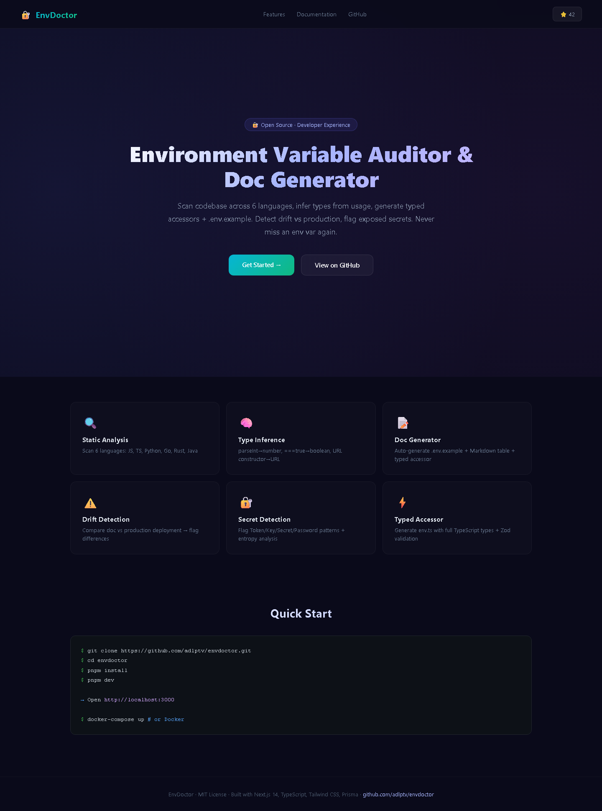

# EnvDoctor — Environment Variable Auditor

> Scan · Detect · Document · Generate

EnvDoctor is a developer tool that scans your codebase for environment variable usage, infers types, detects secrets, checks for configuration drift, and generates typed accessors + documentation automatically.

## Features

### 🔍 Smart Scanning
- Scans source files across **6 languages**: TypeScript, JavaScript, Python, Go, Rust, Java
- Detects `process.env`, `os.getenv`, `env::var`, `System.getenv` patterns
- Tracks usage count and file locations for each variable

### 🧠 Type Inference Engine
- Automatically infers types from:
  - Variable names (`PORT` → number, `DEBUG` → boolean, `*_URL` → url)
  - Default values (`3000` → number, `true` → boolean, `https://...` → url)
  - Usage patterns (`Number()`, `Boolean()`, `new URL()`, `JSON.parse()`)
- Supported types: `string`, `number`, `boolean`, `url`, `json`, `unknown`

### 🔒 Secret Detection
- Flags variables with secret-like names (`API_KEY`, `TOKEN`, `SECRET`, `PASSWORD`)
- Detects known secret formats (Stripe, GitHub, AWS, JWT, private keys)
- High-entropy value detection
- Custom regex pattern support
- Connection string credential detection

### 🔄 Drift Detection
- Compares `.env.example` against actual code usage
- Reports:
  - **Missing**: variables used in code but not in `.env.example`
  - **Unused**: variables in `.env.example` but not in code
  - **Matched**: properly documented variables
- Generates updated `.env.example` from scan results

### 📄 Documentation Generator
- Produces clean **Markdown** documentation with:
  - Summary table (name, type, required, default, secret, description)
  - Categorized sections (secrets, required, optional)
  - Detailed per-variable docs with usage patterns
  - Statistics (by type, by language)
- JSON export for programmatic use
- `.env.example` regeneration

### ⚡ Typed Accessor Generator
- Generates a complete `env.ts` file with:
  - **Zod** schema definitions
  - TypeScript type inference (`z.infer`)
  - Runtime validation with helpful error messages
  - Individual typed accessors
  - Helper functions (`hasEnvVar`, `getRawEnvVar`)
- Copy, paste, ship.

##
## 📸 Screenshots

| Landing Page | Dashboard |
|:---:|:---:|
|  |  |

> 💡 *Run locally to see the full interactive experience: `pnpm dev` then open http://localhost:3000*

 Getting Started

### Prerequisites
- Node.js 18+
- npm/pnpm/yarn

### Installation

```bash
# Clone the repo
git clone https://github.com/yourusername/envdoctor.git
cd envdoctor

# Install dependencies
npm install

# Set up the database
npx prisma generate
npx prisma db push
npm run db:seed

# Start the dev server
npm run dev
```

Open [http://localhost:3000](http://localhost:3000)

### Docker

```bash
# Build and run with Docker Compose
docker-compose up -d

# Or build manually
docker build -t envdoctor .
docker run -p 3000:3000 envdoctor
```

## Usage

### 1. Create a Project
Navigate to `/projects/new` and enter your project details.

### 2. Upload Files
Upload source files that contain environment variable usage. You can also paste your `.env.example` content.

### 3. Configure Scan
Toggle features:
- Secret detection
- Type inference
- Drift detection

### 4. Review Results
View the dashboard with:
- **Variables tab**: Full inventory table with filtering
- **Drift tab**: Missing and unused variables
- **Secrets tab**: Security warnings
- **Docs tab**: Generated Markdown documentation
- **Accessor tab**: Generated TypeScript env.ts file

### 5. Export
Download generated files:
- `ENVIRONMENT.md` — Markdown documentation
- `env.ts` — Typed TypeScript accessor
- `.env.example` — Regenerated env example
- `env-report.json` — JSON export

## API Reference

### Projects
| Method | Endpoint | Description |
|--------|----------|-------------|
| GET | `/api/projects` | List all projects |
| POST | `/api/projects` | Create a project |
| GET | `/api/projects/:id` | Get project details |
| PUT | `/api/projects/:id` | Update a project |
| DELETE | `/api/projects/:id` | Delete a project |

### Scans
| Method | Endpoint | Description |
|--------|----------|-------------|
| GET | `/api/scans` | List scans (optional `?projectId=`) |
| GET | `/api/scans/:id` | Get scan details |
| DELETE | `/api/scans/:id` | Delete a scan |
| GET | `/api/scans/:id/drift` | Get drift report |
| GET | `/api/scans/:id/docs` | Get documentation (markdown/json/env) |
| GET | `/api/scans/:id/accessor` | Get typed accessor code |
| GET | `/api/scans/:id/export` | Export (markdown/json/env/typescript) |

### Scanning
| Method | Endpoint | Description |
|--------|----------|-------------|
| POST | `/api/scan-files` | Upload files and run scan |

### Settings
| Method | Endpoint | Description |
|--------|----------|-------------|
| GET | `/api/settings` | Get settings |
| PUT | `/api/settings` | Update settings |

## Tech Stack

- **Framework**: Next.js 14 (App Router)
- **Language**: TypeScript
- **Database**: SQLite (via Prisma ORM)
- **Validation**: Zod
- **UI**: Tailwind CSS + Radix UI (shadcn/ui)
- **Animations**: Framer Motion
- **Testing**: Vitest + Playwright
- **Deployment**: Docker

## Project Structure

```
envdoctor/
├── prisma/
│   ├── schema.prisma      # Database schema
│   └── seed.ts            # Seed data
├── src/
│   ├── app/               # Next.js App Router pages
│   │   ├── api/           # API routes
│   │   ├── dashboard/     # Dashboard page
│   │   ├── history/       # Scan history
│   │   ├── projects/      # Project pages
│   │   └── settings/      # Settings page
│   ├── components/        # React components
│   │   └── ui/            # shadcn/ui primitives
│   ├── lib/               # Core libraries
│   │   ├── accessor-generator.ts
│   │   ├── constants.ts
│   │   ├── db.ts
│   │   ├── doc-generator.ts
│   │   ├── drift-detector.ts
│   │   ├── scanner.ts
│   │   ├── secret-detector.ts
│   │   ├── type-inference.ts
│   │   ├── utils.ts
│   │   └── validation.ts
│   ├── types/             # TypeScript types
│   └── middleware.ts      # Rate limiting + security
├── tests/                 # Vitest test files
├── Dockerfile
├── docker-compose.yml
└── vitest.config.ts
```

## Testing

```bash
# Run unit tests
npm run test:run

# Run with coverage
npm run test:coverage

# Run E2E tests (requires running server)
npm run test:e2e
```

## License

MIT © 2024 EnvDoctor
